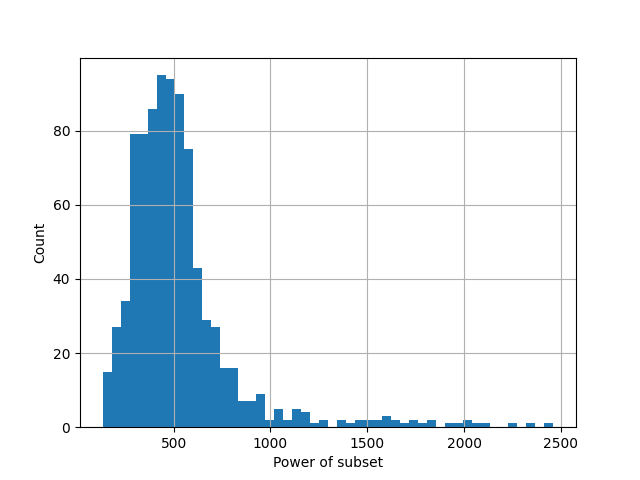

# Задача

Построить множество $M$ минимальной мощности, удовлетворяющее следующим ограничениям:

- среди всех подмножеств $M$ имеются $s$ подмножеств $M_1,\ldots,M_s$
- для каждой из $\frac{s(s-1)}{2}$ пар $(M_i, M_j)$ данных подмножеств известна мощность $m_{ij}$ их пересечения

Решением задачи является множество $M$ с указанными $s$ его подмножествами.

Задача может и не иметь точного решения (или его не удаётся найти). Тогда приемлемым является приближённое решение с ослабленным ограничением:

- мощности пересечений подмножеств могут отличаться от $m_{ij}$

Заданы два критерия качества решения:

- Доля тех пар $M_i,\ldots,M_j$, для которых соблюдается условие $\lvert M_i \cap M_j \rvert = m_{ij}$ (1)
- Величина $\lvert M \rvert$ (2)


# Алгоритм

Представим подмножества как ненаправленный взвешенный граф. Сами подмножества - вершины, их пересечения - ребра.
Вес ребра равен мощности пересечения. Будем жадным алгоритмом искать максимальные по определенному критерию полные подграфы (клики) этого графа.

Этот критерий - это минимальный вес ребра в клике, умноженный на количество вершин в клике. На каждом шаге будем искать такую максимальную клику и вычитать из каждого ребра графа минимальный вес в этой клике, до тех пор пока все веса не будут равны 0. Кликам из одной вершины будет давать вес 0, чтобы приоритизировать экономию новых элементов.

Переходя обратно в пространство нашей задачи, мы получим максимальное количество общих вершин, одновременно принадлежащих нескольким подмножествам.
Стоит отметить, что так как наш алгоритм жадный, то он может не давать оптимального решения. Однако решение, полученное этим алгоритмом всегда будет точно удовлетворять ограничению (1).

# Результат
```
Solution power (M): 121787
Subsets avg power: 527.97
```

