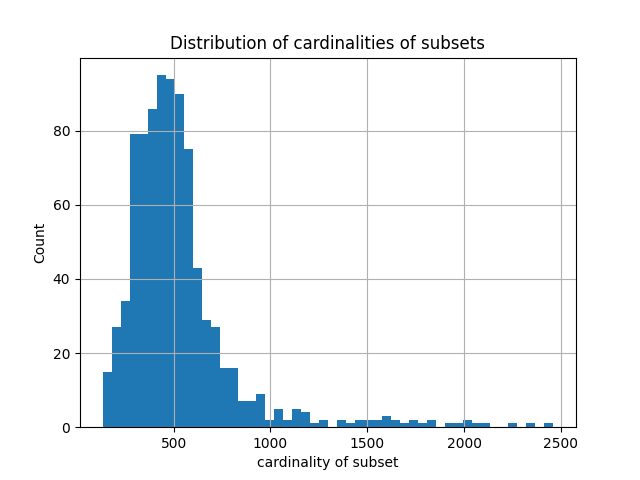

Олег Хорошев 616

# Задача

Построить множество $M$ минимальной мощности, удовлетворяющее следующим ограничениям:

- среди всех подмножеств $M$ имеются $s$ подмножеств $M_1,\ldots,M_s$
- для каждой из $\frac{s(s-1)}{2}$ пар $(M_i, M_j)$ данных подмножеств известна мощность $m_{ij}$ их пересечения

Решением задачи является множество $M$ с указанными $s$ его подмножествами.

Заданы два критерия качества решения:

- Доля тех пар $M_i,\ldots,M_j$, для которых соблюдается условие $\lvert M_i \cap M_j \rvert = m_{ij}$ (1)
- Величина $\lvert M \rvert$ (2)

В данной реализации рассматривается постановка, в которой при фиксированных мощностях (1) мы ищем минимальную мощность (2).

# Baseline
В качестве отправной точки можно взять тривиальную оценку, которая определяется как сумма всех мощностей пересечений подмножеств.

Такая оценка соответствует случаю, где каждое из пересечений является уникальным множеством.

# Алгоритм

Представим подмножества как ненаправленный взвешенный граф. Сами подмножества - вершины, их пересечения - ребра.
Вес ребра равен мощности пересечения. Будем жадным алгоритмом искать максимальные по определенному критерию полные подграфы (клики) этого графа.

Этот критерий - это минимальный вес ребра в клике, умноженный на количество вершин в клике. На каждом шаге будем искать такую максимальную клику и вычитать из каждого ребра подграфа минимальный вес в этой клике (по сути убирать эту клику из графа), до тех пор пока все веса не будут равны 0. Кликам из одной вершины будет давать вес 0, чтобы приоритизировать экономию новых элементов.

Переходя обратно в пространство нашей задачи, мы получим максимальное количество общих вершин, одновременно принадлежащих нескольким подмножествам.
Стоит отметить, что так как наш алгоритм жадный, то он может не давать оптимального решения. Однако решение, полученное этим алгоритмом всегда будет точно удовлетворять ограничению (1).

## Оценки сложности:
Пусть $n$ - это количество вершин графа.
- Поиск произвольной максимальной по включению клики $O(n)$ [1]
- Поиск клики по критерию $O(n^2)$ (начиниаем поиск из каждой вершины)
- Оценка худшего случая $\Omega(n^4\max(w_i))$, где $w_i$ - вес $i$-того ребра.

# Результат
```
Solution power (M): 121'787
Baseline solution power (M): 2'500'772
Subsets avg power: 527.97
```



[1] Skiena, Steven S. (2009), The Algorithm Design Manual (2nd ed.), Springer